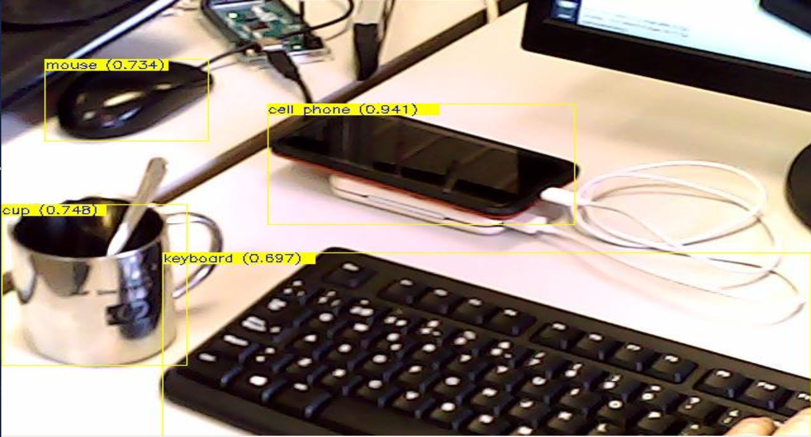

# Tensorflow: Detector 2D C++ API

- [Introduction](#introduction)
- [Trained Models](#trained-models)
- [Requirements](#requirements)
- [Additional Info](#additional-info)
- [Related projects](#related-projects)


## Introduction

`tensorflowDetection2D` module use `tensorflow` C++ API. The module detects using pre-trained models like `VGG16`, `Inception`, `ResNet`, `MobileNet` and other [pre-trained models](https://github.com/tensorflow/models/tree/master/research/slim#pre-trained-models). The module build with `cmake` instead of `bazel` using [tensorflow_cc](https://github.com/FloopCZ/tensorflow_cc). Also use `YARP` to send video source pre and post-procesed. Also admits `YARP` source video like input. The module has been tested with [handstracking model](https://github.com/victordibia/handtracking) and [ssd_mobilenet_v1_coco](https://github.com/tensorflow/models/blob/master/research/object_detection/g3doc/detection_model_zoo.md). This module also publish detection results in `YARP` port.

<p align="center">
  
  <br>Figure 1. Detection example</br>
</p>


## Trained Models

`tensorflowDetection2D` requires a trained model and labels map file. Trained model use `.pb` extension and labels map file `.pbtxt` extension. Files shared by [Drive](https://drive.google.com/drive/folders/1HNSs2x4T9gddpg-FTGR_hx0eJXwxv416?usp=sharing).
`tensorflowDetection2D` use `resource finder` to locate models and label map files. Set downloaded files in `resource finder` allowed path.
Allowed paths can be shown:

```bash
yarp resource 
```

## Requirements

`tensorflowDetection2D` requires:

* [Install OpenCV 3.0.0+](https://github.com/roboticslab-uc3m/installation-guides/blob/master/install-opencv.md)
* [Install YARP 2.3.XX+](https://github.com/roboticslab-uc3m/installation-guides/blob/master/install-yarp.md)
* [Install tensorflow_cc: Shared library](https://github.com/roboticslab-uc3m/installation-guides/blob/master/install-opencv.md)
* [Install Bazel](https://github.com/roboticslab-uc3m/installation-guides/blob/master/install-bazel.md)

Tested on: `ubuntu 14.04`, `ubuntu 16.04`, `ubuntu 18.04` and `lubuntu 18.04`.

## Additional Info

* [Tensorflow: Zoo detection model](https://github.com/tensorflow/models/blob/master/research/object_detection/g3doc/detection_model_zoo.md)

## Related projects

* [victordibia: handtracking project](https://github.com/victordibia/handtracking)[
* [lysukhin: tensorflow-object-detection-cpp example](https://github.com/lysukhin/tensorflow-object-detection-cpp)
* [FloopCZ: tensorflow_cc project](https://github.com/FloopCZ/tensorflow_cc)
* [Tensorflow: #1741 C++ Example to tun object detection models](https://github.com/tensorflow/models/issues/1741#issuecomment-318613222)
* [davidvelascogarcia: Tensorflow: Detector 2D (C++ API)](https://github.com/davidvelascogarcia/tensorflowDetection2D)
